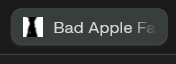

# Bad Apple Animated Favicon

This project plays `bad_apple.mp4` inside the browser tab icon by turning each video frame into a tiny black-and-white favicon.



## What Is In This Project

- `index.html` loads the page, the hidden video, and the favicon script.
- `favicon.js` reads the video frame-by-frame and updates the favicon.

## Disclaimer
I removed the video .mp4 because I don't want to get DMCA'd. If you want to test this out yourself, make sure you have the video at the root of the code. More explanation further below.

## Simple Explanation

The page loads the Bad Apple video in the background and uses it as the source for the favicon animation.

The script grabs the current video frame, shrinks it down to favicon size, converts it to pure black and white, and keeps replacing the tab icon with the updated image. Because that happens continuously while the video plays, the favicon ends up looking animated.

## Technical Explanation

This uses the usual `canvas` to `data:` URL favicon trick. The HTML includes a hidden muted `<video>` element for `bad_apple.mp4` and an empty `<link rel="icon">` tag that gets filled in by JavaScript. Once the video is ready to play, `favicon.js` starts it and creates a small `32x32` canvas that acts as the working surface for the favicon frames.

While the video is playing, the script redraws the current frame onto that canvas on every `requestAnimationFrame`. After drawing, it reads the raw `ImageData`, calculates luminance for each pixel with `0.299 * R + 0.587 * G + 0.114 * B`, and applies a hard threshold so every pixel becomes either full black or full white. That gives the favicon the 1-bit look instead of a blurry grayscale thumbnail.

Once the pixels have been processed, the canvas is turned into a PNG data URL with `canvas.toDataURL("image/png")`, and that string is assigned to the favicon link's `href`. The browser then swaps the tab icon to the new frame. When the video reaches the end, the script resets `currentTime` back to `0` and starts playback again so the animation keeps looping.

## How To Run This Locally

Do **not** double-click `index.html` and open it directly in the browser with a `file://` URL. Use a small local server instead.

### Easiest Method: Node.js + `serve`

0. Gently ask Touhou for the `.mp4` of the Bad Apple video and add it to root. (Right with all the other files) 
   - Rename it to `"bad_apple.mp4"`.
1. Install Node.js from [nodejs.org](https://nodejs.org/).
2. Open a terminal in this project folder:
   - `C:\Users\insxn\Desktop\bad-apple-favicon`
3. Run:

```powershell
npx serve .
```

4. Wait for the terminal to print a local address, usually something like:

```text
http://localhost:3000
```

5. Open that address in your browser.
6. Keep the tab open and look at the tab icon. It should animate.

### Alternative Method: Python

If you already have Python installed, you can use this instead:

```powershell
python -m http.server 8000
```

Then open:

```text
http://localhost:8000
```

## Troubleshooting

- If the favicon does not move, make sure you opened the project through `http://localhost...` and not by double-clicking the file.
- If the browser caches the favicon, refresh the page once or twice.
- If autoplay is blocked in a browser, the video is already muted, which usually avoids that problem.

## License

This project is licensed under the MIT License.
